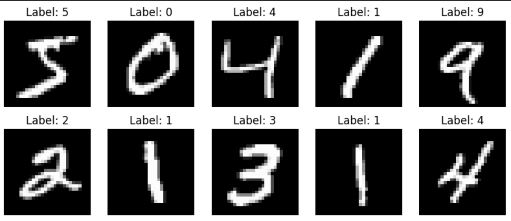
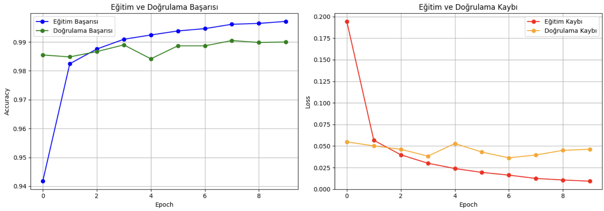
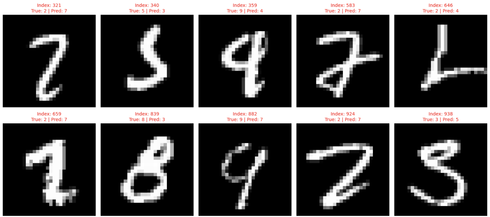

# MNIST El Yazısı Rakam Tanıma: Derin Öğrenme ile Uçtan Uca Sınıflandırma

Bu proje, yapay zeka ve bilgisayarlı görü (Computer Vision) dünyasının temel taşlarından biri olan **MNIST** veri seti üzerinde, geleneksel yöntemlerden modern yaklaşımlara uzanan kapsamlı bir karşılaştırmalı analiz projesidir. Proje kapsamında hem klasik bir **Çok Katmanlı Algılayıcı (MLP)** hem de ileri seviye bir **Evrişimli Sinir Ağı (CNN)** mimarisi inşa edilerek performans farkları mühendislik perspektifiyle değerlendirilmiştir.

---

## 📌 Problem Tanımı
0 ile 9 arasındaki el yazısı rakamların bilgisayarlar tarafından otomatik olarak tanınması, görüntü işlemede kritik bir eşiktir. Bu projede amaç, sadece yüksek doğruluk oranına ulaşmak değil, aynı zamanda modelin pikseller arasındaki mekansal ilişkileri (spatial relationships) nasıl öğrendiğini analiz etmek ve hatalı tahminlerin kök nedenlerini (Root Cause Analysis) görselleştirmektir.

**Projenin Temel Hedefleri:**
* Pikselleri bağımsız girdiler olarak gören MLP ile pikseller arası mekansal ilişkileri (spatial relationships) yakalayan CNN arasındaki farkı ortaya koymak.
* Modelin sadece başarı oranına (Accuracy) değil, hata yapma eğilimlerine (Error Analysis) odaklanmak.
* Eğitim sürecindeki **Overfitting** (ezberleme) riskini grafiklerle valide etmek.

---

## 📊 Veri Seti: MNIST Görüntü Havuzu
* **Veri İçeriği:** 28x28 boyutunda gri ölçekli (Grayscale) el yazısı rakam görselleri.
* **Hacim:** 60.000 eğitim örneği ve 10.000 test örneği.
* **Ön İşleme (Preprocessing):** * **Normalizasyon:** Pikseller 0-1 aralığına çekilerek gradyan inişinin (Gradient Descent) daha hızlı yakınsaması sağlanmıştır.
* **Reshaping:** Veri, CNN mimarisi için (28, 28, 1) formatında 4 boyutlu tensör yapısına dönüştürülmüştür.

  

---

## 🧠 Model Mimari Tasarımı
Projenin merkezinde yer alan CNN modeli, **Sequential** bir yapıda katman katman inşa edilmiştir:

| Katman | İşlev | Neden Kullanıldı? |
| :--- | :--- | :--- |
| **Conv2D (21 Filtre)** | Özellik Çıkarımı | Görüntüdeki düşük seviyeli desenleri (kenar, köşe) yakalamak için. |
| **MaxPooling2D** | Boyut Küçültme | Hesaplama yükünü azaltmak ve modelin şekillere odaklanmasını sağlamak için. |
| **Conv2D (42 Filtre)** | Derin Özellikler | Bir önceki katmanın bulduğu çizgileri birleştirerek karmaşık şekilleri (yuvarlaklar, kesişimler) tanımak için. |
| **Flatten** | Vektörleştirme | 2D özellikleri, karar verici tam bağlantılı katmanlara aktarmak için köprü görevi görür. |
| **Dense (128 Nöron)** | Mantıksal Karar | ReLU aktivasyonu ile yakalanan özellikler arasında doğrusal olmayan bağlantılar kurar. |
| **Dense (10 Nöron)** | Sınıflandırma | **Softmax** kullanarak resmin her bir rakama ait olma olasılığını hesaplar. |

---

## 📈 Eğitim Süreci ve Performans İzleme
Eğitim sırasında 10 epoch boyunca **Adam Optimizer** ve **Sparse Categorical Crossentropy** kayıp fonksiyonu kullanılmıştır.

**Performans Çıktıları:**
* **Eğitim Başarısı (Training Acc):** %99.76
* **Doğrulama Başarısı (Val Acc):** %99.07
* **Eğitim Kaybı (Loss):** 0.0076
Grafiklerde eğitim ve doğrulama (validation) eğrilerinin birbirini takip etmesi, modelin veriyi ezberlemeden genelleyebildiğini göstermektedir.

 

  

---

## 🧩 Detaylı Analiz Metrikleri

### Karmaşıklık Matrisi (Confusion Matrix)
Modelin hata yaptığı noktalar bu matris üzerinden okunabilir. Örneğin, modelin 4 rakamını 9 ile karıştırma sıklığı gibi kritik detaylar burada ortaya çıkarılmıştır.

  

 

### Niteliksel Hata Analizi (Error Analysis)
Projenin en güçlü yanlarından biri, modelin yanlış bildiği yaklaşık 90 örneği görselleştirmesidir. Yapılan incelemede; hataların modelden ziyade, insan gözünün dahi zorlandığı, son derece biçimsiz veya silik yazılmış görsellerden kaynaklandığı tespit edilmiştir.

  

---

## 🏁 Sonuç ve Çıkarımlar
* **Teknik Üstünlük:** Geleneksel MLP modeli %97.83 başarı sağlarken, mekansal verileri işleyebilen CNN modeli **%99.07** başarıya ulaşmıştır.
* **Genelleme Yeteneği:** Hata analizi sonuçları, modelin mantıksal bir hatadan ziyade veri kalitesi sınırlarında yanıldığını ortaya koymuştur.

